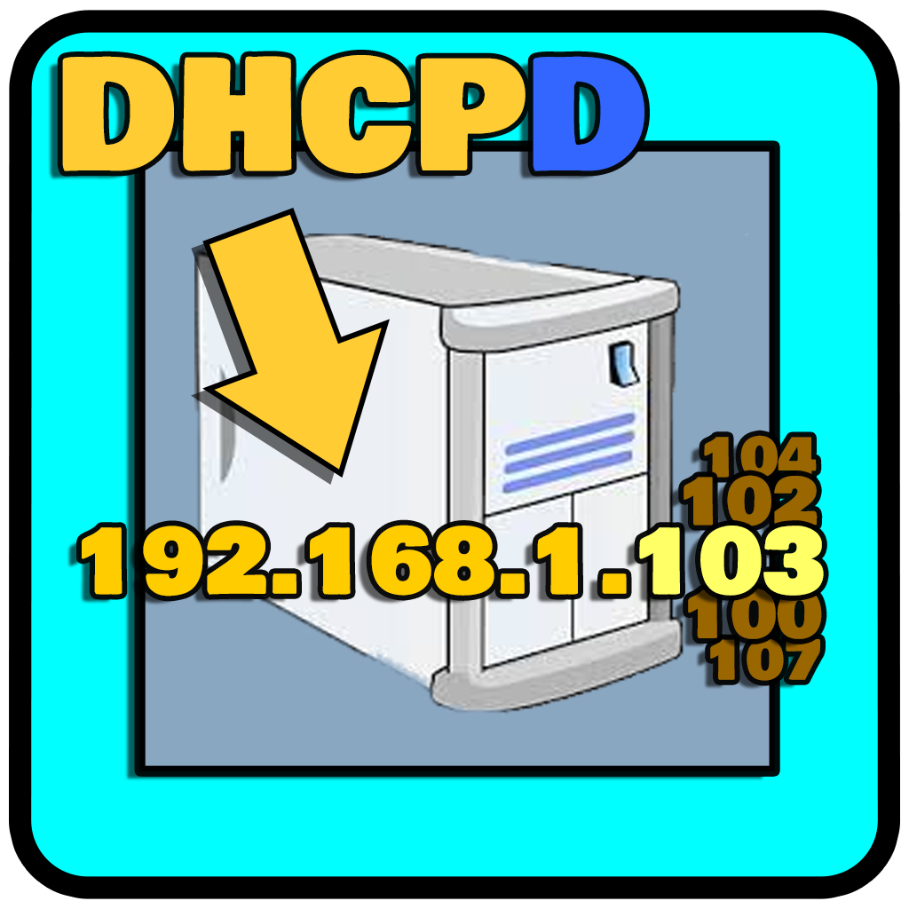

# dhcpD
<TABLE><TR><TD>

 <small>Icon is available only on Windows</small>

# A very small dhcp server

# Getting started
Get the last release clicking on the **Releases** button located on the **GitHUB** right panel 
or just click [here](https://github.com/uomoukko/dhcpD/releases/). It's free for *personal use* 

# Usage
DhcpD will assign only 2 IPs, one for PC and one for DGA/MODEM 
and it will pass the option43 to the modem, to initiate tr069 protocol 
when MODEM/DGA gets this option from dhcpD, it will make a POST to the specified domain. 
 
This program uses macaddresses to detect who is PC and who is DGA 
and it will assign the right IP to them 
At the beginning you can select who is PC and who is DGA from the macaddr list 
PC/ACS ip will be always assigned to 58.162.0.1 (and cannot be changed for now). 
MODEM/DGA ip will be always assigned to 58.162.0.12 (and cannot be changed for now). 
 
when PC ip has been set to 58.162.0.1, program shows PC=1 
when DGA ip has been set to 58.162.0.12, program shows DGA=1 
When both PC and DGA =1 then they can communicate 
   
dhcpD.exe _option43.txt _macaddr.txt MUST be in the same folder 
_option43.txt: change first line to your domain 
_macaddr.txt:  add all your macaddresses of your LAN 
This way you will see the name of the other devices 
requesting dhcp services in your LAN (they are ignored) 
</TD></TR></TABLE>

